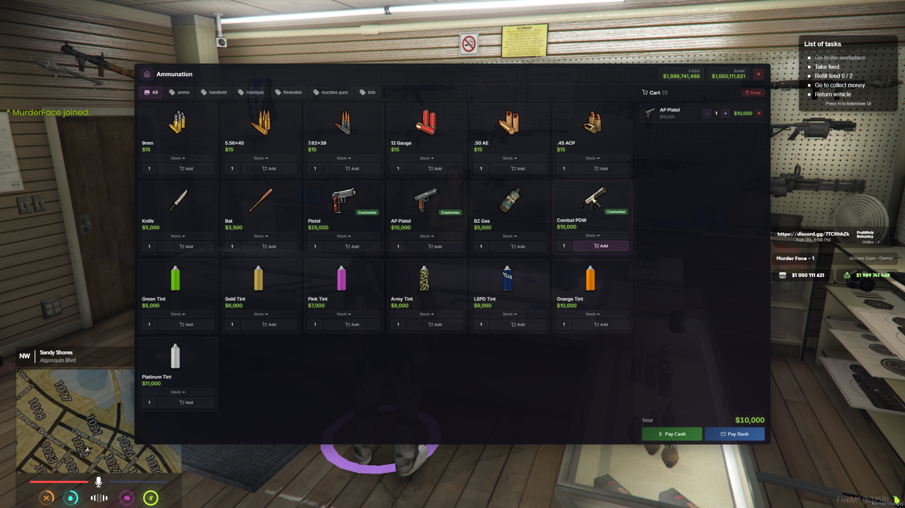
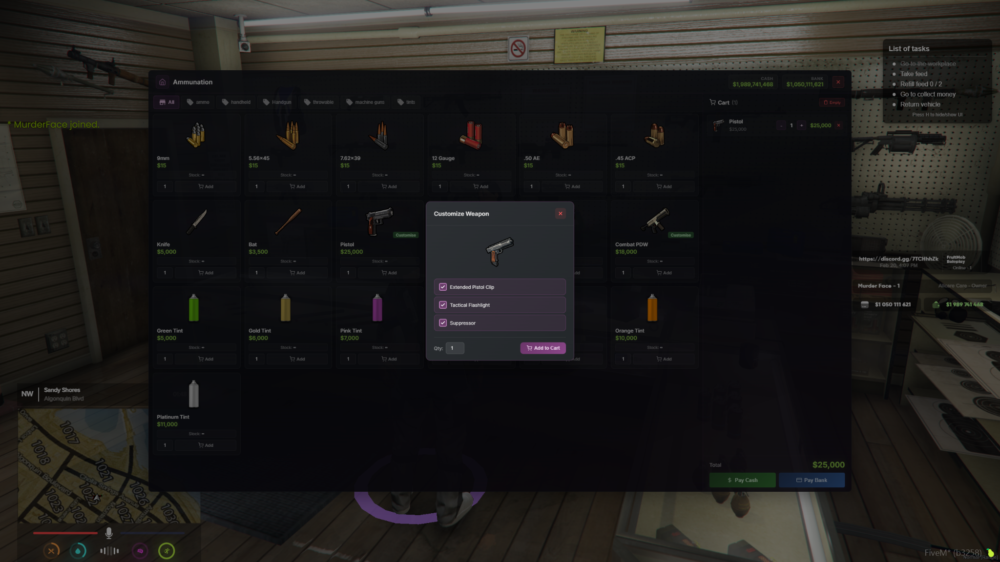
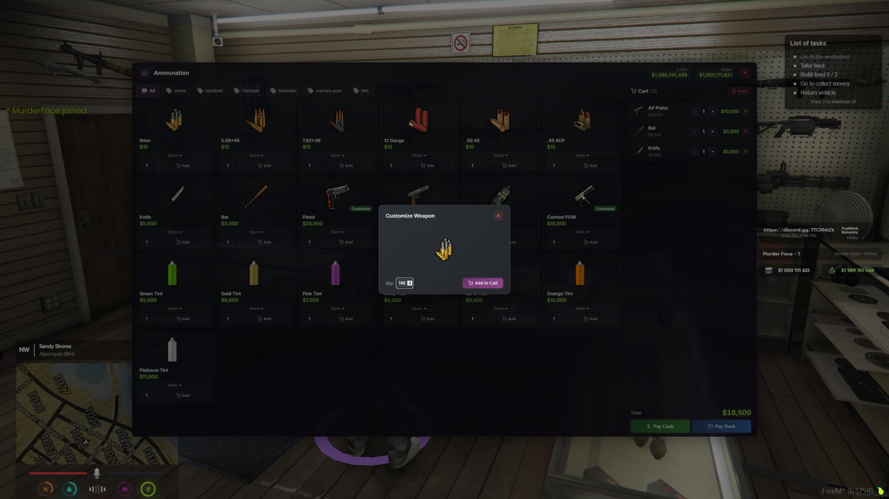
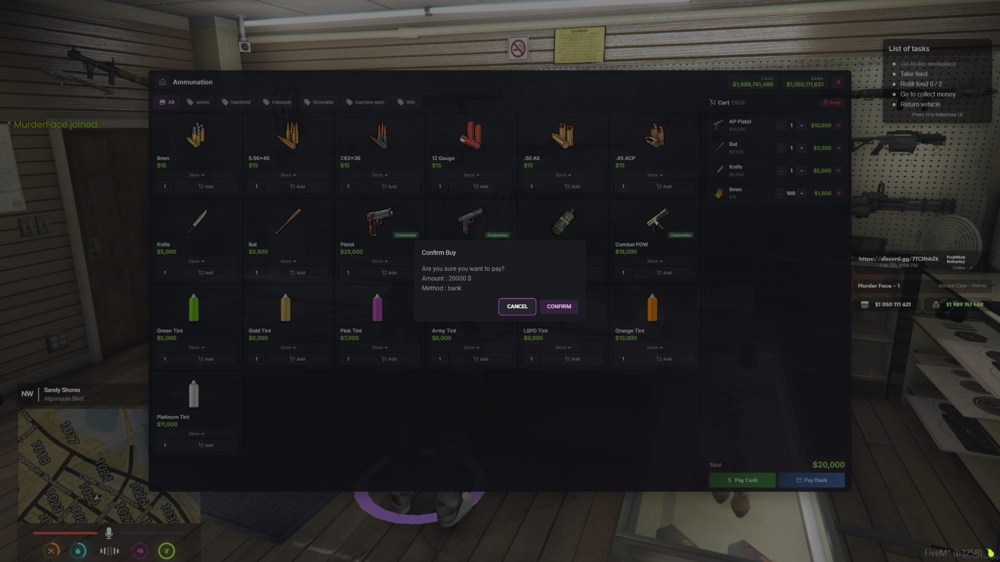

# murderface-shops (Qbox + ox Fork)

**Free, open-source advanced shop system for FiveM** — drop in, configure, sell.

Built for the **Qbox + ox_lib + ox_inventory + ox_target** stack. Gabz MLO compatible. Server-hardened. No SQL imports. No headaches.

> Forked from [renzuzu/renzu_shops](https://github.com/renzuzu/renzu_shops) — original by renzuzu

---

## Preview









---

## Features

### Shop Types
Every store the streets of Los Santos have to offer:
- **24/7 Supermarkets** — 14 locations. Water, snacks, and questionable life choices at 3 AM
- **Ammunation** — 10 locations. Because sometimes diplomacy fails
- **Liquor Stores** — 6 locations. For when the 24/7 doesn't carry your brand
- **Mechanic Supplies** — Wrench jockeys get their own shops (job-restricted)
- **Black Market** — Arms, goods, and a fun house in the sewers. Don't ask questions
- **Vehicle Dealerships** — Browse, preview, and buy rides right from the UI
- **Job Shops** — Police armory, EMS supplies, YouTool — locked behind job requirements
- **Food Vendors** — Bean Machine, Burgershot, UwU Cafe, Pizza This, Bahama Mamas, and more (DRC item pack compatible)
- **Movable Food Trucks** — Chihuahua Hot Dogs, Beefy Bills Burger Bar, Attack A Taco. Set up shop wherever the hungry people are

### Modern NUI Shopping Experience
Custom Vue 3 UI — not your grandma's ox_inventory RegisterShop:
- **Category tabs** with icons — Ammo, Handguns, Shotguns, Throwables, Tints, Melee, the works
- **Item cards** showing price, stock count, and a quick Add button
- **Quantity picker** on every item — buy 1 bullet or buy 1,000, we don't judge
- **Cart panel** on the right — running total with per-item +/- quantity controls and remove
- **Cash or Bank** payment — two buttons, pick your poison
- **Confirm purchase dialog** — one last "are you sure?" before Lester's accountant cries

### Weapon Customization
Trick out your piece without leaving the shop:
- **Attachments** — Extended clips, flashlights, suppressors, grips, scopes, and 60+ components
- **Weapon tints** — Pick from the full GTA V tint palette, preview before you buy
- All attachments write to item metadata — they persist through inventory, drops, and trades

### Item Customization
- **Food variants** — Toppings, ingredients, custom labels (hot dog with extra mustard? done)
- **Status effects** — Hunger, thirst, stress modifiers per variant
- **Custom animations & props** — Eat, drink, and look good doing it

### Player-Owned Shops
Full empire management (enable per-location in `config/ownedshops/`):
- Buy a location and make it yours
- Set your own prices, stock your own inventory
- Hire and fire employees (they get a cut — or they don't, you're the boss)
- Track profits through the cashier and vault system
- Customers rob you sometimes. That's just business in LS

### Shipping & Delivery
- **Fedex Express** supplier system — order stock deliveries to your shop
- 112 delivery points across the map
- Distance-based delivery pay (calculated server-side, no funny business)
- Supplier discounts for bulk orders

### Store Robbery
- Rob any cashier with `ox_lib` skill checks — hope your minigame skills are better than your life choices
- 30-minute cooldown per store. You can't rob the same 24/7 twice in a row, Trevor
- Progress bar + animation while you clean out the register

### Admin Tools
- `/stores` — Full admin panel for managing ownership, stock, employees, and finances
- `/addstock` — Restock shops from console (per-item or bulk)
- Server-side ACL checks on every admin action — no one's creating shops with a modmenu

### Performance & Security
- **MySQL caching** — 5-minute TTL cache cuts database queries by ~95%
- **Server-side price validation** — prices looked up from config, never trusted from the client
- **Server-side distance calculation** — delivery payouts use `GetEntityCoords`, not client-reported values
- **SQL injection protection** — parameterized queries + field whitelists throughout
- **Purchase rate limiting** — 2-second cooldown between purchases to prevent spam
- **State bag whitelisting** — only 4 approved keys, validated types, entity ownership enforced
- **Transaction locking** — no race conditions on stock updates or payments
- **Input sanitization** — every callback validates source, data types, and permissions

### Auto-Setup
- Tables auto-create on first start. No SQL imports. No migration scripts. Just `ensure` it and go.

---

## Quick Start

**1.** Download and extract to your resources as `murderface-shops`

**2.** Add to `server.cfg`:
```cfg
ensure murderface-shops
```

**3.** Restart server — walk to any 24/7, press your target key, buy something. Done.

All shop items must exist in `ox_inventory/data/items.lua`. Check `config/storeitems.lua` if you see missing-item warnings in console.

---

## Configuration

Everything lives in the `config/` folder:

| File | What it controls |
|------|-----------------|
| `config/init.lua` | Framework, target mode, stock defaults |
| `config/storeitems.lua` | Items and prices for each shop type |
| `config/defaultshops.lua` | Shop locations, blips, names |
| `config/ownedshops/` | Purchasable shop locations and pricing |
| `config/jobshops/` | Job-restricted shops (police armory, EMS, etc.) |
| `config/movableshop.lua` | Food truck configuration |
| `config/shipping.lua` | Delivery system, supplier routes, pay rates |
| `data/item_customise.lua` | Item variants, toppings, effects |
| `data/weaponcomponents.lua` | Weapon attachment definitions |

### Basic Settings

```lua
-- config/init.lua
shared.framework = 'QBX'              -- Framework (QBX or ESX)
shared.target = true                  -- Use ox_target (false = markers)
shared.oxShops = false                -- Use ox_inventory shop UI instead
shared.allowplayercreateitem = false  -- Let players add custom items
shared.defaultStock = 100             -- Starting stock for new shops
```

### Adding Shop Locations

```lua
-- config/defaultshops.lua
shared.Coords = {
    General = {
        [1] = {
            coord = vector4(25.74, -1346.74, 29.49, 271.69),
            name = '24/7 Supermarket',
            blip = { sprite = 52, color = 2, scale = 0.6 }
        }
    }
}
```

### Shop Items

```lua
-- config/storeitems.lua
General = {
    { lvl = 1, name = 'water', category = 'Food', price = 50 },
    { lvl = 1, name = 'burger', category = 'Food', price = 150 },
}
```

- `lvl` — Shop level required (1 = always available, 2+ = owned shops only)
- `name` — Must match an item in `ox_inventory/data/items.lua`
- `category` — Display grouping (Food, Medical, Tools, etc.)
- `price` — Base price in dollars

---

## Admin Commands

| Command | Description |
|---------|------------|
| `/stores` | Open admin shop management panel |
| `/addstock General 1 100` | Add 100 of all items to General #1 |
| `/addstock Ammunation 2 50 pistol` | Add 50 pistols to Ammunation #2 |

---

## Dependencies

| Resource | Required |
|----------|----------|
| qbx_core | Yes |
| ox_lib | Yes |
| ox_inventory | Yes |
| oxmysql | Yes |
| ox_target | Optional (can use markers) |

If you're running Qbox with the ox stack, you already have everything you need.

---

## What Changed From the Original

- **Qbox native** — Full QBX integration with proper player wrapper and money handling
- **Custom Vue 3 NUI** — Complete UI rewrite. Dark glassmorphism theme with neon accents, category tabs, cart panel, weapon customization modals
- **MySQL caching** — 5-minute cache, moved GlobalState data to MySQL (was hitting 16KB limit)
- **Server-side security** — Price validation, distance calculation, ACL checks, state bag whitelisting, rate limiting, input sanitization. Cheaters get nothing
- **Bug fixes** — All Lua syntax errors (`+=`, `-=`), shop UI closing bug, race conditions
- **Gabz + DRC** — MLO compatibility and full DRC restaurant vendor support
- **Error handling** — Debug logging, item validation against ox_inventory, automatic recovery

## Troubleshooting

**Items not appearing in shop?**
Check they exist in `ox_inventory/data/items.lua`. Console will warn you about missing items.

**Shop UI closes immediately?**
Fixed in this version. If it persists, check for empty shop sections in `storeitems.lua`.

**Target not working?**
Set `shared.target = true` in `config/init.lua` for ox_target, or `false` for markers.

**Need to import SQL?**
No — tables auto-create on first start.

**Dark/black overlay behind the UI?**
`backdrop-filter` is broken in FiveM's CEF. This version already has the fix baked in. If you're forking, never use `backdrop-filter: blur()` in NUI pages.

See [DEPLOYMENT.md](DEPLOYMENT.md) for full testing checklist and [CONFIGURATION.md](CONFIGURATION.md) for advanced options.

---

## Credits

- **Original script**: [renzuzu](https://github.com/renzuzu) (original renzu_shops)
- **Qbox conversion & enhancements**: [FruitMob RP](https://github.com/fruitmob)

## License

GPL-3.0 — same as the original.
